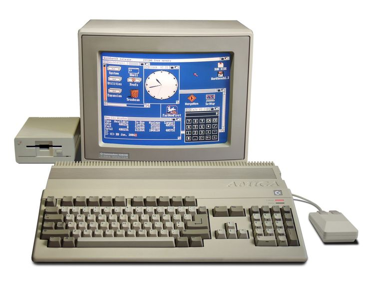
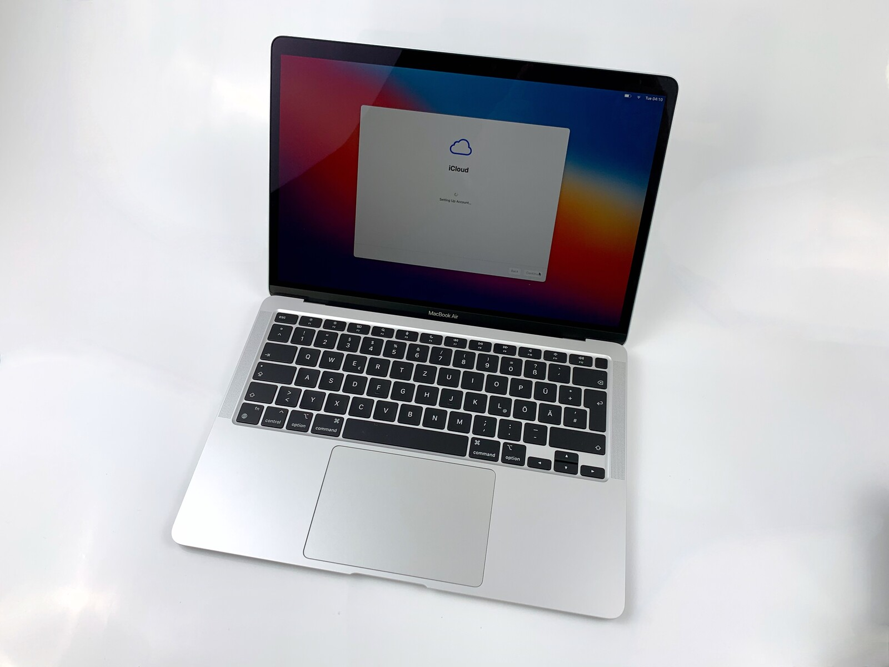

# Classic Computer Comparison

## Commodore Amiga 500
The *Amiga 500*, was released by the manufactoring company Commodore in 1987. This has a processor called Motorola 68000 with a speed of 7.14MHz. It has an internal 880K 3.5-inch floppy storage, a memory of 512k, and graphics of 640 x 256, 6bpp. 

> [Click here to find out more](https://www.computinghistory.org.uk/det/7800/Commodore-Amiga-A500/)

*** 

## MacBook Air 
This *MacBook Air*, was released by Apple in 2020. It has a processor called Dual-Core Intel Core i3 with a speed of 1.1 GHZ. It has a storage of 251GB called Macintosh HD, has a memory of 8GB, and graphics of 1536MB called Intel Iris Plus Graphics. 

---

## Comparison Summary

| Technical Information    | Amiga 500                      | MacBook air 
| ------------------------ | ------------------------------ | -------------------------------- 
| Processor type and speed | 7.14 MHz Motorola 68000        | 1.1 GHz Dual-Core Intel Core i3 
| Graphics                 | 640 × 256, 6 bpp               | Intel Iris Plus Graphics 1536 MB 
| Storage                  | Internal 880 K 3.5-inch floppy | Macintosh HD 251 GB 
| Memory                   | 512 K                          | 8 GB 

*** 

### More Information about Amiga 500
1. https://www.computinghistory.org.uk/det/7800/Commodore-Amiga-A500/
2. https://oldcomputers.net/amiga500.html
3. https://www.howtoretro.com/commodore-amiga-the-definitive-guide/
4. https://vintage-computer.com/machines.php?amiga500 
